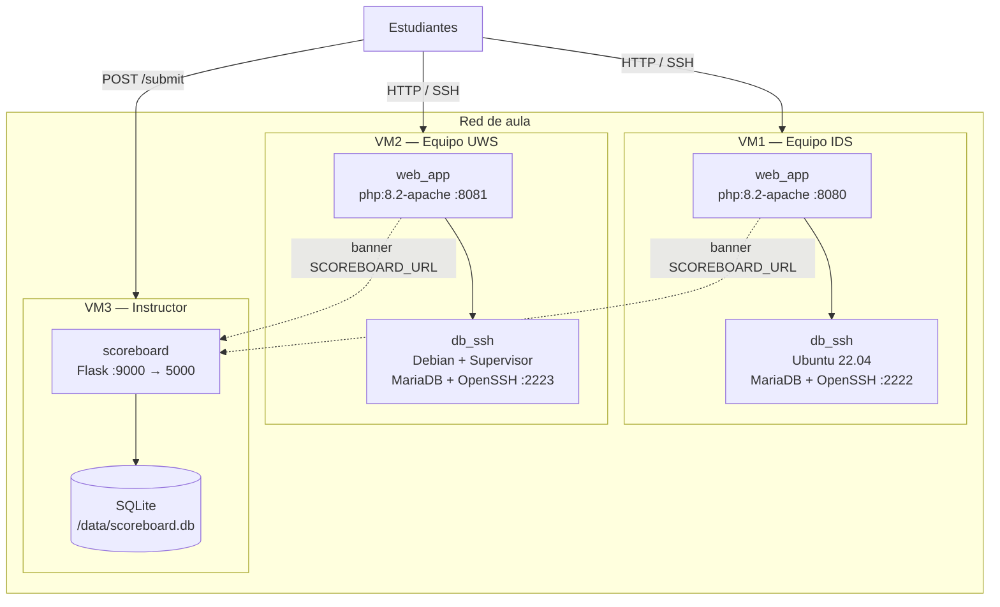
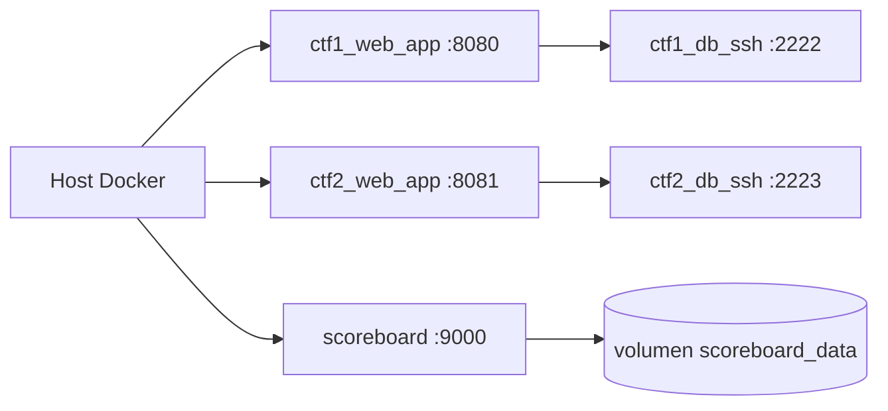

# CTF UCC — Documentación para auditoría y transferencia

**Software:** CTF UCC Demo (laboratorio Attack & Defend)  
**Edición de referencia:** 0.5 / escenario 15 vs 15  
**Institución:** Universidad Cooperativa de Colombia, sede Ibagué  
**Área:** Ingeniería de sistemas — ciberseguridad aplicada  
**Tipo:** Laboratorio educativo intencionalmente inseguro (no es software de producción)  
**Repositorio compañero:** plataforma de entrenamiento [preCTF](../../preCTF/) (`D:\juandmm1233\preCTF`)

Este documento describe el **caso de estudio**, la **arquitectura** y las **tecnologías** del laboratorio. Completa (no sustituye) los manuales de instructor y de equipo.

| Documento operativo | Audiencia |
|---------------------|-----------|
| [README.md](../README.md) | Índice general y reglas del juego |
| [README_INSTRUCTOR.md](../README_INSTRUCTOR.md) | Despliegue, banderas, mitigaciones, scoreboard |
| [ctf1/README.md](../ctf1/README.md) | Manual único del Equipo IDS |
| [ctf2/README.md](../ctf2/README.md) | Manual único del Equipo UWS |
| [RED_TEAM_PLAYBOOK.md](RED_TEAM_PLAYBOOK.md) / [BLUE_TEAM_PLAYBOOK.md](BLUE_TEAM_PLAYBOOK.md) | Referencia técnica de aula |
| [arquitectura-ctf-ucc.html](arquitectura-ctf-ucc.html) | Presentación visual de arquitectura |

---

## 1. Caso de estudio

### 1.1 Contexto académico

La sesión práctica de ciberseguridad reúne ~30 estudiantes de Ingeniería de Sistemas durante **3 horas**. El objetivo no es “ganar un CTF de internet”, sino reproducir en aula un ciclo realista de **operación, ataque y defensa** sobre aplicaciones web clásicas (patrón LAMP), con reglas claras de alcance y sin denegación de servicio.

El laboratorio modela dos empresas ficticias de la región:

| Identidad | Sigla | Equipo | Qué opera |
|-----------|-------|--------|-----------|
| Ibagué Data Services | IDS | Equipo IDS | VM1 — aplicación PHP + MariaDB + SSH |
| UCC Web Services | UWS | Equipo UWS | VM2 — clon funcional con otra identidad visual |

Un tercer host (VM del instructor) corre el **scoreboard**: tablero único de puntajes. No es un blanco del ejercicio.

### 1.2 Problema que resuelve el software

Formar a estudiantes en vulnerabilidades web **en un entorno controlado, reproducible y acotado**, con estas tensiones:

- Debe ser **vulnerable por diseño** (si se endurece de fábrica, no hay ejercicio).
- Debe ser **operable por equipos** (sysadmin + defensa + ataque simultáneos).
- Debe ser **justo**: mismas 8 familias de vectores en ambos labs; una bandera cuenta una vez por equipo.
- Debe ser **seguro para la universidad**: no se expone a Internet; el alcance son las VMs del aula.
- Debe **conectarse** con un entrenamiento previo (preCTF) para que la clase competitiva no sea el primer contacto con cada vector.

### 1.3 Modelo pedagógico: Attack & Defend simultáneo

A diferencia de un Red vs Blue tradicional (un equipo solo ataca y el otro solo parchea), **cada equipo es full-stack**:

| Equipo | Defiende | Ataca |
|--------|----------|-------|
| IDS | VM1 (`:8080`, SSH `:2222`) | VM2 UWS (`:8081`) |
| UWS | VM2 (`:8081`, SSH `:2223`) | VM1 IDS (`:8080`) |

**Tres objetivos obligatorios:**

1. El servicio web propio debe seguir respondiendo (HTTP 200).
2. Obtener banderas del rival y/o más puntos al cierre (8 banderas reales por VM).
3. Si el servicio propio cae más de **10 minutos consecutivos**: derrota por knock-out.

Hay objetivos extra (uptime, informe técnico, explicación oral de parches, reporte de honeypots). Las banderas trampa (`FLAG{HONEYPOT_*}` / `FLAG{FAKE_*}`) restan puntos.

### 1.4 Relación con preCTF

Los dos repositorios se entregan juntos como **un solo caso de estudio en dos fases**:

```
preCTF (antes de la clase)
  Portal React + FastAPI + PostgreSQL
  8 niveles secuenciales, una instancia aislada por estudiante
  Flags FLAG{PRECTF_N*}  →  token PRECTF-UCC-…
           ↓
CTF UCC (día de la clase)
  Dos labs PHP vulnerables + scoreboard Flask
  Mismos 8 vectores, flags FLAG{UCC_*} distintas
  Attack & Defend 15 vs 15
```

preCTF **construye** su imagen de entrenamiento desde `ctf1/` de este repositorio (contexto Docker externo). No se duplica el código vulnerable dentro de preCTF. Las flags de clase **no** deben coincidir con las de entrenamiento.

Documentación espejo: `preCTF/docs/DOCUMENTACION.md`.

### 1.5 Actores

| Actor | Responsabilidad |
|-------|-----------------|
| Instructor | Despliega 3 VMs (o all-in-one de prueba), rota banderas, opera el scoreboard, hace health checks, califica informes |
| Equipo IDS | Opera y parchea IDS; ataca UWS; envía flags al tablero |
| Equipo UWS | Opera y parchea UWS; ataca IDS; envía flags al tablero |
| Estudiante en preCTF | Completó los 8 niveles *antes*; no usa este scoreboard en la fase 1 |

### 1.6 Alcance y no-alcance (auditoría)

**Es:** un CTF de aula containerizado, inseguro por diseño, con documentación de mitigación para el equipo defensor.

**No es:**

- Software de producción, API de negocio ni sistema con TLS/HA.
- Un producto para exponer en Internet público.
- Un conjunto de herramientas ofensivas de uso libre fuera del aula.
- El portal de progreso (eso es preCTF).

**Reglas de alcance en clase:** no DoS, no atacar IPs ajenas a las VMs, no apagar Apache/MariaDB/SSH propios, no borrar rutas activas (sí se puede modificar/parchear).

### 1.7 Vectores didácticos (catálogo, sin procedimientos)

Cada lab expone las **mismas ocho familias**. El detalle de explotación y de parche está en los playbooks y en el manual del instructor; este documento solo nombra el catálogo para el auditor.

| # | Familia de defecto | Superficie | Puntos |
|---|--------------------|------------|-------:|
| 1 | Inyección SQL | Login web | 50 |
| 2 | Control de acceso / cookie | Panel administrativo | 75 |
| 3 | Inclusión local de archivos | Descarga / preview | 60 |
| 4 | Fuga de configuración | Encadenado con LFI | 70 |
| 5 | Inyección de comandos | Herramientas de red | 80 |
| 6 | Hash débil (MD5) | Secretos en base de datos | 100 |
| 7 | Carga insegura (RCE) | Upload | 120 |
| 8 | Credenciales SSH débiles | Contenedor db+ssh | 150 |

CSRF existe como vector bonus en documentación; **no** tiene flag en el scoreboard de esta edición. Hay **3 honeypots** que penalizan (−50).

---

## 2. Arquitectura

### 2.1 Tipo de aplicación

Tres stacks Docker Compose independientes:

1. **Lab IDS (`ctf1/`)** — aplicación web clásica (PHP renderiza HTML en servidor) + MariaDB + OpenSSH.
2. **Lab UWS (`ctf2/`)** — mismo patrón, otra imagen de SO en el contenedor de datos (Debian + Supervisor) e identidad visual distinta.
3. **Scoreboard (`scoreboard/`)** — Flask + plantillas Jinja + SQLite.

No es una arquitectura de microservicios de negocio, ni cluster Swarm/Kubernetes. El driver de red es **bridge** (un Compose por máquina). Overlay no aplica.

### 2.2 Vista de despliegue en clase (producción pedagógica)



Cada lab tiene su propia base MariaDB. **No hay replicación** entre IDS y UWS. Por eso el scoreboard debe existir **una sola vez**: si se levanta en las dos VMs, los puntajes se duplican y no se sincronizan.

### 2.3 Vista all-in-one (solo pruebas del instructor)

El `docker-compose.yml` de la raíz une IDS + UWS + scoreboard en `ctf_local_net`. **No debe usarse en la clase 15v15.** Sirve para verificar que las imágenes construyen y los puertos responden.



### 2.4 Flujo de una petición web

1. El estudiante abre `:8080` o `:8081` (o SSH `:2222` / `:2223`).
2. Apache + PHP 8.2 sirve `/var/www/html` (bind mount del código en el host de cada VM).
3. PHP se conecta a MariaDB por TCP interno (`DB_HOST`, puerto 3306 **no publicado** al host).
4. El envío de banderas es un `POST /submit` HTTP hacia el scoreboard; SQLite persiste el envío.

MariaDB escucha en la red bridge. Desde el navegador **no** se alcanza el puerto 3306. El DNS embebido de Docker resuelve `db_ssh` (compose por VM) o `ctf1_db_ssh` / `ctf2_db_ssh` (all-in-one).

### 2.5 Componentes por lab

```
ctf1/  o  ctf2/
├── docker-compose.yml     web_app + db_ssh
├── servidor_web/          PHP (index, admin, download, network, upload, …)
│   ├── includes/{auth,db,layout}.php
│   ├── config/app.ini
│   ├── bucket/            archivos del LFI didáctico
│   └── uploads/
└── mysql_ssh/
    ├── Dockerfile
    ├── init.sql           users, secrets, hashes, honeypots
    └── entrypoint.sh      MariaDB + sshd + bandera SSH
```

El código PHP se monta por **bind mount**: un parche del Blue Team en el host se refleja sin reconstruir la imagen web. Las bases MariaDB viven en el filesystem del contenedor `db_ssh`; `docker compose down -v` las elimina.

### 2.6 Scoreboard

Aplicación Flask mínima:

| Recurso | Función |
|---------|---------|
| `GET /` | Tablero HTML |
| `POST /submit` | Alta de bandera (equipo `ids` o `uws` + alias) |
| SQLite `/data/scoreboard.db` | Persistencia (volumen `scoreboard_data`) |
| `SCOREBOARD_RESET_PASSWORD` | Reset del tablero; no va en el código |

No tiene autenticación fuerte de jugadores ni rate limiting de producción. El reset falla cerrado si la variable de entorno no está definida; hay bloqueo temporal tras intentos fallidos.

Los labs solo muestran un **banner con enlace** (`SCOREBOARD_URL`); no escriben en la base SQLite del tablero.

### 2.7 Contrato de puertos

| Destino | Host (clase / all-in-one) | Interior del contenedor | Protocolo |
|---------|---------------------------|-------------------------|-----------|
| IDS web | VM1:8080 / localhost:8080 | 80 | HTTP Apache |
| IDS SSH | VM1:2222 / localhost:2222 | 22 | SSH |
| UWS web | VM2:8081 / localhost:8081 | 80 | HTTP Apache |
| UWS SSH | VM2:2223 / localhost:2223 | 22 | SSH |
| Scoreboard | VM3:9000 / localhost:9000 | 5000 | HTTP Flask |
| MariaDB | no publicado | 3306 | TCP interno |

Todos los servicios usan `restart: unless-stopped`.

### 2.8 Clasificación para el auditor

| Pregunta | Respuesta |
|----------|-----------|
| ¿Arquitectura de producción? | No. Laboratorio de aula. |
| ¿Apps web clásicas o SPA? | Clásicas (PHP + sesión por cookie). Scoreboard con Jinja. |
| ¿API REST de negocio? | No. Scoreboard tiene POST de flags; los labs no son un backend JSON. |
| ¿Intencionalmente vulnerable? | Sí, el código web de `ctf1/` y `ctf2/`. |
| ¿El scoreboard es vulnerable por diseño? | No es el blanco; es simple y sin hardening de producción. |
| ¿preCTF forma parte de este repo? | No. Es el repositorio hermano; consume `ctf1` como contexto de build. |

---

## 3. Tecnologías usadas

### 3.1 Resumen por stack

| Stack | Tecnología | Versión de referencia | Rol |
|-------|------------|----------------------|-----|
| Lab web | PHP | 8.2 | Lógica de la aplicación vulnerable |
| Lab web | Apache HTTP Server | (imagen `php:8.2-apache`) | Servidor HTTP |
| Lab web | extensión **mysqli** | instalada al arrancar | Conector PHP → MariaDB |
| Lab datos IDS | Ubuntu | 22.04 | SO del contenedor db+ssh |
| Lab datos UWS | Debian Bookworm + Supervisor | — | Variante de SO (mismo rol) |
| Lab datos | MariaDB | (paquete distro) | Usuarios, secretos, hashes |
| Lab datos | OpenSSH Server | — | Vector SSH y operación |
| Tablero | Python | 3.12-slim | Runtime |
| Tablero | Flask | 3.0.3 | HTTP + plantillas |
| Tablero | sqlite3 (stdlib) | — | Persistencia de envíos |
| Tablero | Jinja2 | (dependencia Flask) | HTML del marcador |
| Red | Docker Compose | v2 | Un compose por VM |
| Red Docker | driver **bridge** | default | DNS interno + NAT de puertos |
| Volumen | driver **local** | default | `scoreboard_data` → `/data` |
| Contenido | HTML/CSS, SQL | — | UI de labs e `init.sql` |

No hay JDBC, Hibernate, Node ni PostgreSQL en este repositorio. El conector de aplicación de los labs es **mysqli** sobre TCP 3306 interno. El del tablero es **sqlite3** a archivo.

### 3.2 Lenguajes y artefactos

| Componente | Lenguaje | Artefacto principal |
|------------|----------|---------------------|
| IDS / UWS web | PHP 8.2 | `ctf1/servidor_web/`, `ctf2/servidor_web/` |
| Init de datos | SQL | `mysql_ssh/init.sql` |
| Arranque db+ssh | Bash | `mysql_ssh/entrypoint.sh` |
| Scoreboard | Python 3.12 | `scoreboard/app.py` |
| Infra | YAML | `docker-compose.yml` en raíz, `ctf1/`, `ctf2/`, `scoreboard/` |

### 3.3 Drivers y conectores (detalle)

| Capa | Driver / conector | Dónde | Para qué |
|------|-------------------|-------|----------|
| Docker Network | bridge | `ctf1_net`, `ctf2_net`, `ctf_scoreboard_net`, `ctf_local_net` | Comunicación intra-VM y publicación de puertos |
| Docker Volume | local | `scoreboard_data` | Persistir `scoreboard.db` |
| PHP → MariaDB | mysqli (extensión C) | `includes/db.php` | `new mysqli(DB_HOST, …, 3306)` |
| PHP runtime | `docker-php-ext-install mysqli` | `command` de `web_app` | Instala el driver en caliente |
| Flask → SQLite | sqlite3 | `scoreboard/app.py` | Archivo `/data/scoreboard.db` |
| SSH | OpenSSH | `db_ssh` | Administración y vector didáctico |

**Por qué bridge y no overlay:** overlay aplica a Swarm/Kubernetes multi-nodo. Cada VM corre un único Compose; el switch virtual de bridge es el modelo correcto.

### 3.4 Imágenes Docker

| Servicio | Imagen base |
|----------|-------------|
| `*_web_app` | `php:8.2-apache` |
| `ctf1_db_ssh` | build `ubuntu:22.04` + MariaDB + OpenSSH |
| `ctf2_db_ssh` | build Debian + Supervisor + MariaDB + OpenSSH |
| `ctf_scoreboard` | build `python:3.12-slim` |

### 3.5 Variables de entorno relevantes

| Variable | Componente | Uso |
|----------|------------|-----|
| `SCOREBOARD_URL` | labs | Banner hacia el tablero |
| `DB_HOST`, `DB_USER`, `DB_PASS`, `DB_NAME` | labs | Conexión PHP → MariaDB |
| `DB_ADMIN_USER`, `DB_ADMIN_PASS` | labs | Alta de usuarios desde el panel (ejercicio) |
| `SCOREBOARD_RESET_PASSWORD` | scoreboard | `scoreboard/secrets.env` (no versionar secretos reales) |
| `SCOREBOARD_DB` | scoreboard | Ruta SQLite (default `/data/scoreboard.db`) |

### 3.6 Arranque de referencia

**Clase (3 VMs):**

```bash
# VM1
cd ctf1 && export SCOREBOARD_URL=http://<IP-SCOREBOARD>:9000 && docker compose up -d --build

# VM2
cd ctf2 && export SCOREBOARD_URL=http://<IP-SCOREBOARD>:9000 && docker compose up -d --build

# VM3
cd scoreboard && docker compose up -d --build
```

**Prueba local del instructor:**

```bash
docker compose up -d --build
# IDS http://localhost:8080  ·  UWS :8081  ·  Scoreboard :9000
```

---

## 4. Notas de seguridad para el auditor

1. El laboratorio **debe** contener defectos; auditar “ausencia de SQLi” en `index.php` sería un falso positivo pedagógico.
2. Lo que sí corresponde auditar: que **no se exponga a Internet**, que las flags de clase se **roten**, que `secrets.env` no lleve contraseñas reales a git, que el scoreboard sea **una instancia**, y que preCTF use **otras** flags.
3. Al cerrar el ejercicio: `docker compose down -v` en cada VM.
4. No reutilizar credenciales ni patrones de código vulnerable fuera del aula.
5. Los playbooks ofensivos existen para la clase; no son un manual de ataque a sistemas ajenos.

---

## 5. Entregable conjunto

| Repositorio | Función en el caso de estudio |
|-------------|-------------------------------|
| **CTF UCC** (este) | Laboratorio competitivo Attack & Defend |
| **preCTF** | Campo de entrenamiento secuencial previo; orquesta una instancia de `ctf1` con flags distintas |
